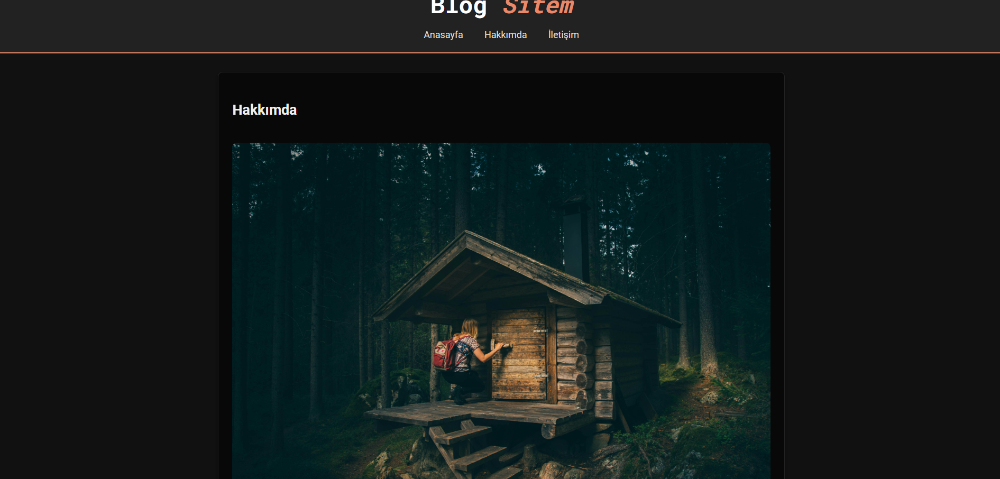

# Basic-BlogSite


*Bu görsel, Basic-BlogSite projenizin ana sayfasının bir anlık görüntüsüdür ve projenin genel tasarımına dair hızlı bir bakış sunar.*

---

## Projeye Giriş: Neden Bu Blog?

Bu proje, kodlama yolculuğunuzda önemli bir mihenk taşını temsil ediyor. Basit bir blog sitesi gibi görünse de, fikirlerinizi, düşüncelerinizi ve deneyimlerinizi dijital bir platformda paylaşma gücünü size sunuyor. Bir web geliştiricisi olarak attığınız her adımda, öğrendiklerinizle nasıl somut çıktılar yaratabileceğinizi gösteren bu blog, gelecekteki çok daha büyük ve karmaşık projelerinizin sadece bir başlangıcı. Bu proje, sadece bir kod yığını değil, dijital kimliğinizin ve yaratıcılığınızın ilk adımıdır.

---

## Proje Hakkında

Bu proje, içerik oluşturucuların kolayca yazılarını yayınlayabileceği ve okuyucuların da bu içeriklere rahatça erişebileceği **Basic-BlogSite** adlı temel bir blog platformudur. Kullanıcı dostu arayüzü ve sade yapısıyla, hem geliştirme sürecine yeni başlayanlar için anlaşılır bir örnek teşkil etmekte hem de kişisel blog oluşturma ihtiyacını karşılamaktadır. Amacımız, basitlik ve işlevselliği bir araya getirerek, dijital içerik yayıncılığına sağlam bir temel atmaktı.

---

## Temel Özellikler

* **Yazı Oluşturma ve Görüntüleme:** Kullanıcıların blog yazılarını oluşturmasına, düzenlemesine ve kolayca görüntülemesine olanak tanır.
* **Basit ve Anlaşılır Arayüz:** Karmaşıklıktan uzak, sezgisel bir kullanıcı deneyimi sunar.
* **Kullanıcı Dostu Tasarım:** Projenin basit yapısı sayesinde, hem geliştiriciler hem de son kullanıcılar için kolay anlaşılır bir deneyim sunar.

---

## Kullanılan Teknolojiler

Bu proje, web geliştirmenin temel yapı taşları kullanılarak geliştirilmiştir:

* **HTML5:** İçeriğin yapılandırılması ve web sayfalarının iskeletini oluşturmak için.
* **CSS3:** Görsel tasarım, stil ve kullanıcı arayüzünün estetiği için.

---

## Kurulum ve Çalıştırma

Projeyi yerel makinenizde hızla çalışır duruma getirmek için aşağıdaki adımları izleyin:

1.  Bu depoyu bilgisayarınıza klonlayın:
    ```bash
    git clone [https://github.com/ImNot-Virus/Basic-BlogSite.git](https://github.com/ImNot-Virus/Basic-BlogSite.git)
    ```
2.  Proje dizinine geçiş yapın:
    ```bash
    cd Basic-BlogSite
    ```
3.  Ana HTML dosyasını (`Proje-2` klasörü içinde yer alan `inde.html` veya benzeri bir dosya) tercih ettiğiniz herhangi bir web tarayıcısında açın.

---

## Gelecek Planları ve Katkıda Bulunun

Bu blog projesi, öğrenmeye ve geliştirmeye açık bir platformdur. Onu daha ileriye taşımak için atılabilecek birçok adım var. İşte bazı fikirler, ancak yaratıcılığınızı kullanmaktan çekinmeyin:

* **Dinamik İçerik Yönetimi:** Blog yazılarını bir veritabanında (örneğin, SQLite, MySQL veya MongoDB) depolayarak kalıcı hale getirin. Bunun için bir backend dili (Python, Node.js, PHP) kullanmanız gerekebilir.
* **Kullanıcı ve Yönetici Panelleri:** Yazarları ve site yöneticilerini yönetmek için bir kimlik doğrulama sistemi ekleyin.
* **Arama ve Filtreleme:** Blog yazılarını etiketlere, kategorilere veya anahtar kelimelere göre arama ve filtreleme özellikleri geliştirin.
* **Gelişmiş Arayüz:** Daha modern ve dinamik bir kullanıcı deneyimi için CSS framework'leri (Tailwind CSS, Bootstrap) veya JavaScript kütüphaneleri (React, Vue, Angular) entegre edin.
* **Yorum Sistemi:** Okuyucuların blog yazılarına yorum yapabilmesini sağlayın.

Unutmayın, her büyük başarı küçük bir adımla başlar. Bu blog projesi, yeteneklerinizi sergilemek ve sürekli öğrenmeye devam etmek için harika bir fırsat. Katkılarınızla bu projeyi daha da zenginleştirebiliriz!

---

## Lisans

Bu proje açık kaynaklıdır ve belirli bir lisans belirtilmemiştir.

---

## EL DİABLO
